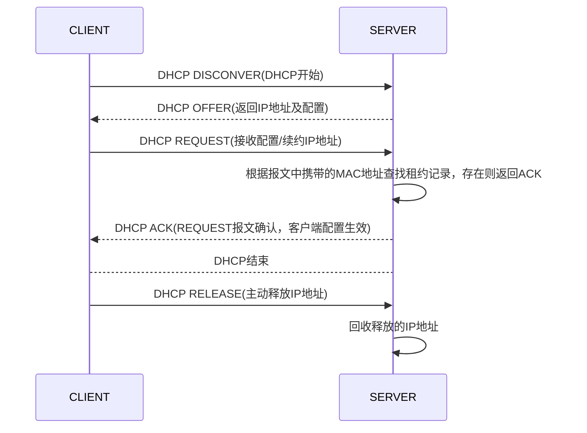

[toc]

# 简介

**DHCP(动态主机配置协议)**  是一个局域网的网络协议。

# 主要功能

由服务器控制一段IP地址范围，客户机登录服务器时就可以自动获得服务器分配的IP地址和子网掩码。担任DHCP服务器的计算机需要安装TCP/IP协议，并为其设置静态IP地址、子网掩码、默认网关等内容。

# 工作原理

## IP分配方式

DHCP服务器提供了三种IP分配方式：

1. **自动分配**：当DHCP客户端第一次成功的从DHCP服务器获取一个IP地址后，就永久的使用这个IP地址。
2. **手动分配**：由DHCP服务器管理员专门指定的IP地址
3. **动态分配（常用）**：当客户端第一次从DHCP服务器获取到IP地址后，并非永久使用该地址，每次使用完后，DHCP客户端就需要释放这个IP，供其他客户端使用。

## 租约过程

**<u>客户端从DHCP服务器获得IP地址的过程叫做DHCP的租约过程。</u>**

**IP地址的有效使用时间段称为==租用期==，租用期满之前，客户端必须向DHCP服务器请求继续租用。服务器接受请求后才能继续使用，否则无条件放弃。**

默认情况下，路由器隔离广播包，不会将收到的广播包从一个子网发送到另一个子网。当DHCP服务器和客户端不在同一个子网时，充当客户端默认网关的路由器将广播包发送到DHCP服务器所在的子网，这一功能就称为DHCP中继（DHCP Relay）。

**DHCP在工作过程中涉及到的报文种类及其作用如下：**

1. DHCP DISCOVER（广播）：DHCP客户端在请求IP地址时并不知道DHCP服务器的位置，因此DHCP客户端会在本地网络内以广播方式发送Discover请求报文，以发现网络中的DHCP服务器。所有收到Discover报文的DHCP服务器都会发送应答报文，DHCP客户端据此可以知道网络中存在的DHCP服务器的位置。
2. DHCP OFFER（广播，单播）：DHCP服务器收到Discover报文后，就会在所配置的地址池中查找一个合适的IP地址，加上相应的租约期限和其他配置信息（如网关、DNS服务器等），构造一个Offer报文，发送给DHCP客户端，告知用户本服务器可以为其提供IP地址。但这个报文只是告诉DHCP客户端可以提供IP地址，最终还需要客户端通过ARP来检测该IP地址是否重复。
3. DHCP REQUEST（广播，单播）：DHCP客户端可能会收到很多Offer请求报文，所以必须在这些应答中选择一个。**通常是选择第一个Offer应答报文的服务器作为自己的目标服务器**，并向该服务器发送一个广播的Request请求报文，通告选择的服务器，希望获得所分配的IP地址。
4. DHCP DECLINE（单播）：当客户端发现服务器分配的IP地址无法使用（如IP地址冲突时），将发出此报文，通知服务器禁止使用该IP地址，以期获得新的IP地址。
5. DHCP ACK（广播，单播） ：DHCP服务器收到Request请求报文后，根据Request报文中携带的用户MAC来查找有没有相应的租约记录，如果有则发送ACK应答报文，通知用户可以使用分配的IP地址。**客户端收到此报文后，才真正获得了IP地址和相关的配置信息。**
6. DHCP NAK（广播，单播）：如果DHCP服务器收到Request请求报文后，没有发现有相应的租约记录或者由于某些原因无法正常分配IP地址，则向DHCP客户端发送NAK应答报文，通知用户无法分配合适的IP地址。客户端收到此报文后，会重新开始新的DHCP过程。
7. DHCP RELEASE（单播）：客户端主动释放服务器分配的IP地址。当服务器收到此报文后，则回收该IP地址，并可以将其分配给其它的客户端。
8. DHCP INFORM（单播，基本不用）：客户端获得IP地址后，发送此报文请求获取服务器的其它一些网络配置信息，如DNS等。

DHCP服务器向DHCP客户端出租的IP地址一般都有一个租借期限，期满后DHCP服务器便会收回出租的IP地址。为了能继续使用原先的IP地址，DHCP客户端会向DHCP服务器发送续租的请求。

**续租的工作流程描述如下：**

1. 在使用租期过去**50%**时刻处， 客户端向服务器发送单播DHCP REQUEST报文续延租期。

2. 如果收到服务器的DHCP ACK报文，则租期相应向前延长，续租成功。如果没有收到DHCP ACK报文，则客户端继续使用这个IP地址。在使用租期过去**87.5%**时刻处，向服务器发送单播DHCP REQUEST报文续延租期。

3. 如果收到服务器的DHCP ACK报文，则租期相应向前延长，续租成功。如果没有收到DHCP ACK报文，则客户端继续使用这个IP地址。在使用**租期到期时**，客户端**自动放弃**使用这个IP地址，并**开始新的DHCP过程**。

